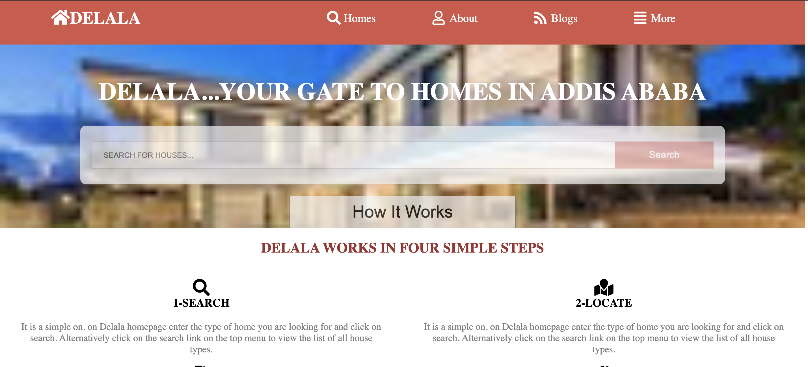

# Project Name :CAPSTONE PROJECT

> Delala is a web page app that is built by taken Patashule's web page as a reference. the layout is fully taken from Patashule. but the content is different.it is rendered to three screen sizes. I used HTML and CSS to build the web page.

Additional description about the project and its features.

## Built With

- HTML &
- CSS

## Live Demo

[Live Demo Link](https://addis0943.github.io/Capstone-Project/)
[Vedio-Link](https://www.loom.com/share/34ba09836de349dd871da004903a9851)

## Getting Started

To get a local copy up and running follow these simple example steps.

### Prerequisites

- Computer
- Internet Connection
- basic Knowledge of Html and css

### Setup

- Vs Code
- Git
- github

### Install

- VS code
- Git
- Github

## To get local copy up and running follow these simple example steps

- git clone git@github.com:Addis0943/Capstone-Project.git
- cd Capstone-Project

### Linters.

Install some dependencies by running the following command

npm install --save-dev stylelint@13.3.x stylelint-scss@3.17.x stylelint-config-standard@20.0.x stylelint-csstree-validator

Run the following command to check linters

npx stylelint "\*_/_.{css,scss}"

### Deployment

Install and run a live server plugin on your Text editor.

👤 **Author1**

- GitHub: [@Addis0943](https://github.com/Addis0943)
- Twitter: [@Addis32018084](https://twitter.com/Addis32018084)
- LinkedIn: [LinkedIn](https://www.linkedin.com/in/addis-belete-134b98191/)

## 🤝 Contributing

Contributions, issues, and feature requests are welcome!

Feel free to check the [issues page](issues/).

## Show your support

Give a ⭐️ if you like this project!

## Acknowledgments

- Hat tip to Mathew Njuguna and others on Behance

## 📝 License

This project is [MIT](./LICENSE) licensed.
